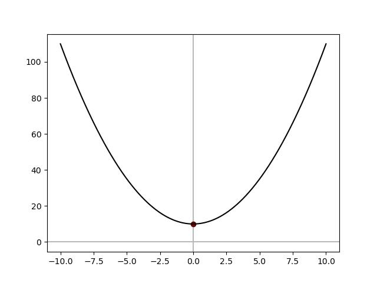
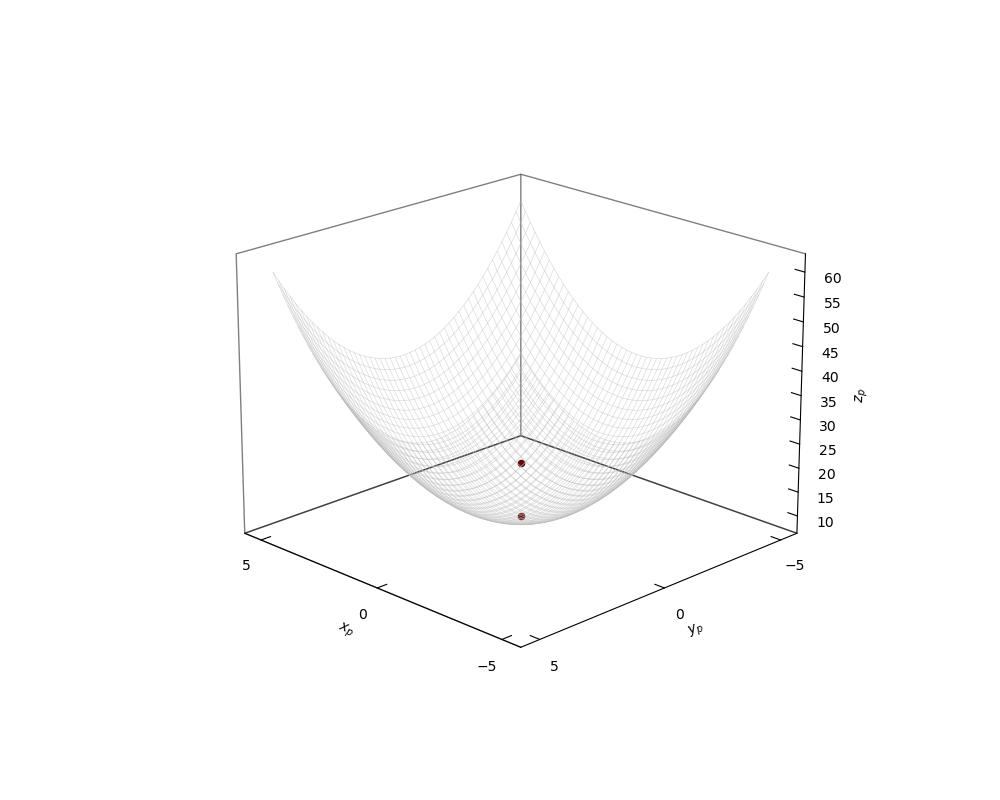
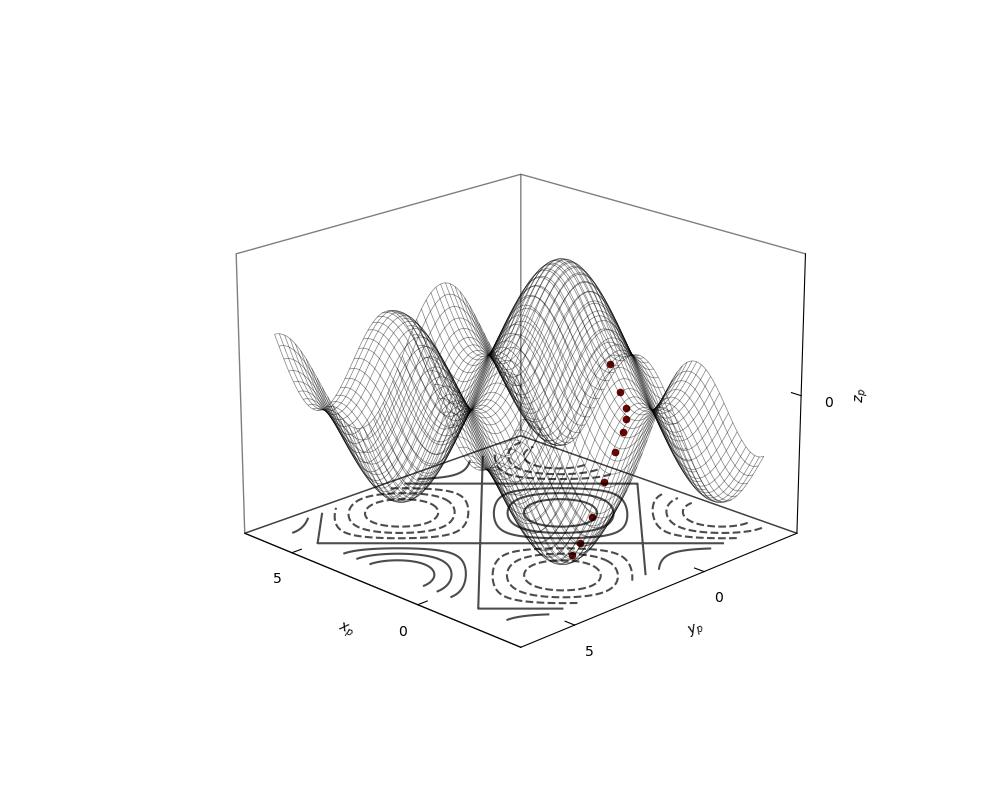
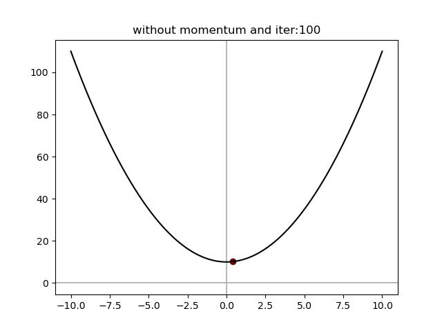
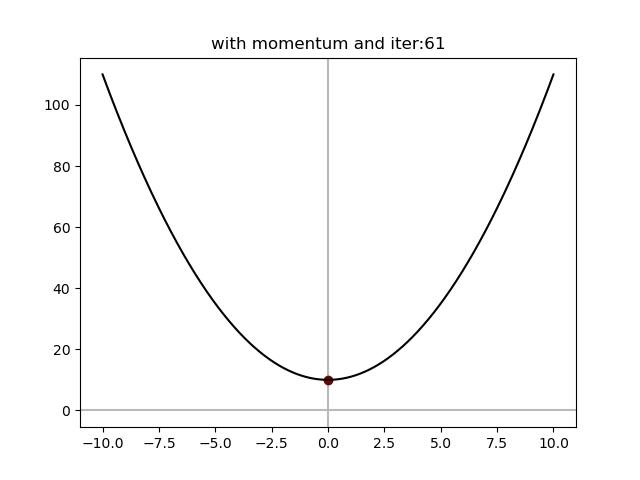

# Gradiente Descendente f(x)

$$ f(\theta) = \theta^{2} + 10 $$
<p align="center">
  
</p>


```python
import numpy as np  
import matplotlib.pyplot as plt 

plt.rcParams['toolbar'] = 'none'
color = {"black":"#000000", "green":"#488c2e", "purple":"#6a0606", "gray":"#b9b9b9"}

a, b, c = 1, 0, 10

x  = np.linspace(-10, 10, 1000)
y = a*x**2 + b*x + c

def f(x):
    return x**2 + 10

def df(x):
    return 2*x

theta = 3
lr    = 0.1
iter  = 100

for i in range(iter):
    gradient = df(theta)
    theta -= lr*gradient

print(f"({theta}, {f(theta)})")


plt.plot(x, y, color=color["black"])
plt.scatter(theta, f(theta), color=color["purple"])

plt.axvline(0, color=color["gray"], linestyle='-', zorder=0)
plt.axhline(0, color=color["gray"], linestyle='-', zorder=0)
plt.show()
```


# Gradiente Descendente f(x, y)


$$ f(x, y)= x^{2} + y^{2 + 10} $$

<p align="center">
  
</p>

```python
import matplotlib.pyplot as plt
from mpl_toolkits.mplot3d import Axes3D
import numpy as np
from matplotlib.ticker import MultipleLocator


color = {"black":"#000000", "green":"#488c2e", "purple":"#6a0606", "gray":"#b9b9b9"}
# Configuración de estilo
#plt.rcParams['font.size']   = 15
#plt.rcParams['font.family'] = 'serif'
plt.rcParams['toolbar']     = 'none'


def f(x, y):
    return x**2 + y**2 + 10

x    = np.linspace(-5, 5, 50)
y    = np.linspace(-5, 5, 50)
x, y = np.meshgrid(x, y)
z    = f(x, y)

def gradiente(x, y):
    df_dx = 2*x
    df_dy = 2*y
    return df_dx, df_dy

#Desenso por gradiente 

theta_x = 15 
theta_y =-15
lr    = 0.1 
iter  = 10

for i in range(iter):
    df_dx, df_dy = gradiente(theta_x, theta_y)
    theta_x -= lr*df_dx 
    theta_y -= lr*df_dy

print(theta_x, theta_y, f(theta_x, theta_y))

fig = plt.figure(figsize=(10, 8))

ax  = fig.add_subplot(111, projection="3d")
#ax.plot_surface(x, y, z, cmap="Greens")
ax.plot_wireframe(x, y, z, color=color["gray"], linewidth=0.5, alpha=0.5)
ax.scatter(0, 0, 10, color=color["purple"])
ax.scatter(theta_x, theta_y, f(theta_x, theta_y), color=color["purple"])
#YlGn

ax.set_xlabel(r'$x_p$')
ax.set_ylabel(r'$y_p$')
ax.set_zlabel(r'$z_p$')
#ax.set_title('Gráfica de una Recta y una Esfera en 3D')

#ax.text(x.min()*1.1, y.min()*1.1, z.max()*1.1, r'$Q(x_p,y_p)$')
ax.view_init(elev=20, azim=135)
ax.grid(False)
ax.xaxis.pane.set_edgecolor('black')
ax.yaxis.pane.set_edgecolor('black')
ax.zaxis.pane.set_edgecolor('black')
ax.xaxis.pane.fill = False
ax.yaxis.pane.fill = False
ax.zaxis.pane.fill = False

ax.xaxis.set_major_locator(MultipleLocator(5))
ax.yaxis.set_major_locator(MultipleLocator(5))
ax.zaxis.set_major_locator(MultipleLocator(5))

ax.xaxis._axinfo['tick']['inward_factor'] = 0
ax.xaxis._axinfo['tick']['outward_factor'] = 0.4
ax.yaxis._axinfo['tick']['inward_factor'] = 0
ax.yaxis._axinfo['tick']['outward_factor'] = 0.4
ax.zaxis._axinfo['tick']['inward_factor'] = 0
ax.zaxis._axinfo['tick']['outward_factor'] = 0.4

#plt.legend()
plt.savefig("graph.jpg")
plt.show()
```


# GD dos variables periodicas 

$$ z (x, y)  = sin(x) + cos(y) $$

<p align="center">
  
</p>

```python
import matplotlib.pyplot as plt
from mpl_toolkits.mplot3d import Axes3D
import numpy as np
from matplotlib.ticker import MultipleLocator

# Colores
color = {
    "black": "#000000", 
    "green": "#488c2e", 
    "purple": "#6a0606", 
    "gray": "#b9b9b9"
}

# Configuración de estilo
#plt.rcParams['font.size'] = 15
#plt.rcParams['font.family'] = 'serif'
plt.rcParams['toolbar'] = 'none'

# Función objetivo
def f(x, y):
    return np.sin(x) + np.cos(y)
    #return x**2 + y**2 + 10

# Generación de datos
x = np.linspace(-np.pi, 2*np.pi, 500)
y = np.linspace(-np.pi, 2*np.pi, 500)
x, y = np.meshgrid(x, y)
z = f(x, y)

# Cálculo del gradiente
def gradiente(x, y):
    df_dx = np.cos(x)  # 2*x
    df_dy = -np.sin(y) # 2*y
    return df_dx, df_dy

# Parámetros para el descenso por gradiente
theta_x = 0.1 
theta_y = 0.1
lr = 0.5
iter = 10

# Listas para almacenar los últimos valores de las iteraciones
last_thetas_x = []
last_thetas_y = []

# Ejecución del descenso por gradiente
for i in range(iter):
    df_dx, df_dy = gradiente(theta_x, theta_y)
    theta_x -= lr * df_dx 
    theta_y -= lr * df_dy
    if i >= iter - 10:  # Guardar los valores de las últimas 5 iteraciones
        last_thetas_x.append(theta_x)
        last_thetas_y.append(theta_y)

# Creación de la figura 3D
fig = plt.figure(figsize=(10, 8))
ax = fig.add_subplot(111, projection="3d")

# Graficar los puntos del descenso por gradiente
for i in range(iter):
    ax.scatter(last_thetas_x[i], last_thetas_y[i], f(last_thetas_x[i], last_thetas_y[i]), color=color["purple"])

# Superficie y contornos
ax.plot_wireframe(x, y, z, color=color["black"], linewidth=0.5, alpha=0.5)
ax.contour(x, y, z, zdir='z', offset=ax.get_zlim()[0], colors=color["black"], alpha=0.7)

# Configuración de los ejes y visualización
ax.set_xlabel(r'$x_p$')
ax.set_ylabel(r'$y_p$')
ax.set_zlabel(r'$z_p$')
ax.view_init(elev=20, azim=135)
ax.grid(False)
ax.xaxis.pane.set_edgecolor('black')
ax.yaxis.pane.set_edgecolor('black')
ax.zaxis.pane.set_edgecolor('black')
ax.xaxis.pane.fill = False
ax.yaxis.pane.fill = False
ax.zaxis.pane.fill = False
ax.xaxis.set_major_locator(MultipleLocator(5))
ax.yaxis.set_major_locator(MultipleLocator(5))
ax.zaxis.set_major_locator(MultipleLocator(5))
ax.xaxis._axinfo['tick']['inward_factor'] = 0
ax.xaxis._axinfo['tick']['outward_factor'] = 0.4
ax.yaxis._axinfo['tick']['inward_factor'] = 0
ax.yaxis._axinfo['tick']['outward_factor'] = 0.4
ax.zaxis._axinfo['tick']['inward_factor'] = 0
ax.zaxis._axinfo['tick']['outward_factor'] = 0.4

# Guardar y mostrar la gráfica
#plt.legend()
plt.savefig("graph.jpg")
plt.show()

```

# GD con momentum 

<div style="display: flex; justify-content: center;">
  
  
</div>


```python
import numpy as np  
import matplotlib.pyplot as plt 


plt.rcParams['toolbar'] = 'none'
color = {"black":"#000000", "green":"#488c2e", "purple":"#6a0606", "gray":"#b9b9b9"}

x  = np.linspace(-10, 10, 1000)


def f(x):
    return x**2 + 10

def df_dx(x):
    return 2**x

theta = 3
lr    = 0.01
v     = 0
gamma = 0.5
iter  = 61

for i in range(iter):
    gradient = df_dx(theta)
    v        = gamma*v + lr*gradient
    theta   -= v 

print(f"({theta}, {f(theta)})")


plt.plot(x, f(x), color=color["black"])
plt.scatter(theta, f(theta), color=color["purple"])

plt.axvline(0, color=color["gray"], linestyle='-', zorder=0)
plt.axhline(0, color=color["gray"], linestyle='-', zorder=0)
plt.title(f"with momentum and iter:{iter}")
plt.savefig("f_1v_m.jpg")
plt.show()
```


