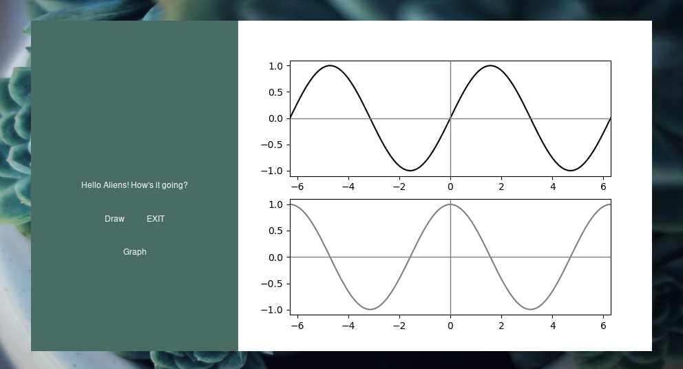
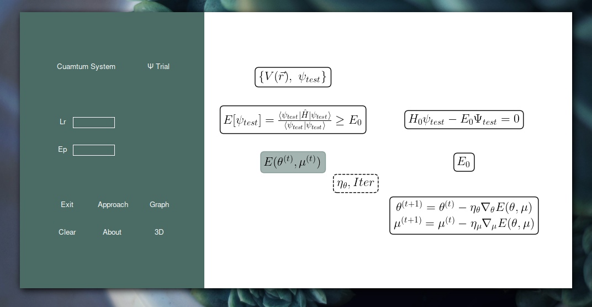
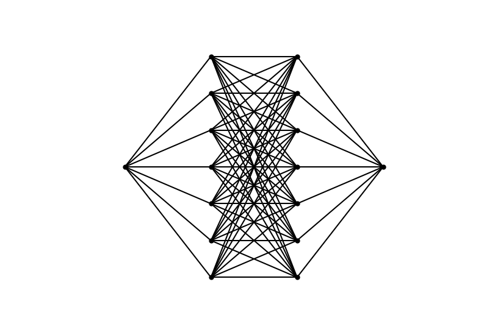

## Degree Porject 

### Main objetive

Desarrollo de un software educativo para aplicar el método variacional a diversos sistemas cuánticos, utilizando el descenso por gradiente como herramienta de optimización.

### Specific objetives 

- [ ] Modificación del sistemas estudiado
- [ ] Aplicación del método variacional
- [ ] Aplicación del GD con y sin momentum
- [ ] Visualización de la densidad de probabilidad y la energía asociada al estado


# Mi Proyecto

https://github.com/user-attachments/assets/e1a03be2-2c94-4a56-a956-8eea33ea16c5

# Gui 


<p align="center">
  
</p>

<p align="center">
  
</p>

# NN diagram constructed 

<p align="center">
  
</p>

## Implementacion del gradiente desencente 

```python
import numpy as np  
import matplotlib.pyplot as plt 

plt.rcParams['toolbar'] = 'none'
color = {"black":"#000000", "green":"#488c2e", "purple":"#6a0606", "gray":"#b9b9b9"}

a, b, c = 1, 0, 10

x  = np.linspace(-10, 10, 1000)
y = a*x**2 + b*x + c

def f(x):
    return x**2 + 10

def df(x):
    return 2*x

theta = 3
lr    = 0.1
iter  = 100

for i in range(iter):
    gradient = df(theta)
    theta -= lr*gradient

print(f"({theta}, {f(theta)})")


plt.plot(x, y, color=color["black"])
plt.scatter(theta, f(theta), color=color["purple"])

plt.axvline(0, color=color["gray"], linestyle='-', zorder=0)
plt.axhline(0, color=color["gray"], linestyle='-', zorder=0)
plt.show()

```
